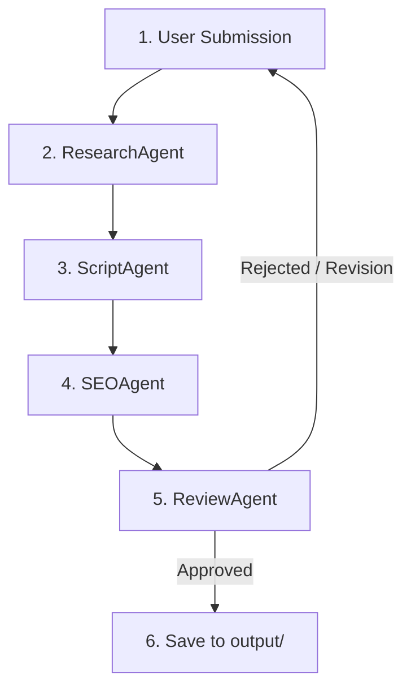

# ContentOS — AI Content Operations Agent Architecture

This document defines the architecture, stack configurations, coding conventions, strict system-level rules, channel voice constraints, and execution workflow for ContentOS. It serves as static context for all agents in the pipeline.

---

## 1. Stack Configuration
*   **Framework:** Google Agent Development Kit (ADK) 2.0
*   **Language:** Python 3.11+
*   **API & Frontend:** Flask
*   **Models:** Gemini API (configured with `gemini-2.5-flash` or `gemini-2.5-pro` for complex workflows)
*   **Capabilities / Tools:** MCP `web_search` for external data retrieval

---

## 2. Strict System Rules (Hard Rules)
All agents in ContentOS must strictly adhere to the following guardrails:

1.  **Explicit Human Approval Required:** Never publish, post, or distribute any output automatically. Every produced draft must receive human sign-off via the dashboard before final processing.
2.  **No Fact Fabrication (Zero Hallucination):** Never manufacture statistics, quotes, or claims. All factual assertions must originate from information retrieved in the research brief.
3.  **Session Isolation:** Do not refer to sources, data, or context not actively retrieved in the current session.
4.  **Citations & URLs:** Always embed source URLs in the script/output when external data, facts, or statistics are referenced.
5.  **Voice Compliance:** All scripts must align 100% with the channel voice guidelines detailed below.
6.  **Never Log or Expose Environment Variables:** Ensure environment variables, access tokens, and API credentials are never written to log files, output files, or exposed in system messages.
7.  **Never Commit `.env` to Version Control:** The `.env` file contains actual secrets and must be kept strictly local. Only commit the template file `.env.example`.

---

## 3. Channel Voice Constraints

*   **Channel Name:** `RennAsks`
*   **Tone:** Smart older sibling who's done being polite about it.
*   **Style Guidelines:**
    *   **Strict lowercase only:** The narration text should favor lowercase for a casual, text-like conversational flow.
    *   **Direct & blunt:** No fluff, no padding, gentle but brutally honest advice or breakdowns.
    *   **Target Audience:** 18-28 year olds in the US and UK. Use vocabulary and references that resonate with Gen Z and young Millennials.
    *   **Structure:**
        1.  `Hook` (Immediate attention grabber — no introductions or greetings)
        2.  `3 Main Points` (Clear, blunt arguments)
        3.  `CTA` (Natural, non-corporate Call-to-Action)
    *   **Banned Phrases (Negative Constraints):**
        *   Never say "in today's video," "welcome back," "make sure to subscribe," or "let's dive in."
        *   Avoid corporate terminology or marketing speak.

---

## 4. Multi-Agent Workflow
The ContentOS pipeline operates sequentially across 5 specialized nodes, coordinated by the main Orchestrator:

1.  **User Submission:**
    The user inputs a content idea or prompt via the frontend.
2.  **[ResearchAgent](file:///c:/Users/acer/OneDrive%20-%20ELCOT/Desktop/contentos/agents/research_agent.py):**
    *   Gathers 3 to 5 high-quality sources using the MCP `web_search` tool.
    *   Compiles a factually verified Markdown research brief with source URLs.
3.  **[ScriptAgent](file:///c:/Users/acer/OneDrive%20-%20ELCOT/Desktop/contentos/agents/script_agent.py):**
    *   Synthesizes the research brief into a complete script.
    *   Applies the `RennAsks` channel voice and structure.
4.  **[SEOAgent](file:///c:/Users/acer/OneDrive%20-%20ELCOT/Desktop/contentos/agents/seo_agent.py):**
    *   Generates optimized video titles, tags, and a conceptual brief for the thumbnail design.
5.  **[ReviewAgent](file:///c:/Users/acer/OneDrive%20-%20ELCOT/Desktop/contentos/agents/review_agent.py):**
    *   Assembles the research brief, draft script, and SEO metadata.
    *   Presents the complete package to the user on the dashboard for review, editing, or approval.
6.  **Output Export:**
    *   Upon explicit human approval, the final verified package is exported and saved to the `output/` directory.

---

## 5. Development Conventions
*   All agent definition modules must reside inside the [`agents/`](file:///c:/Users/acer/OneDrive%20-%20ELCOT/Desktop/contentos/agents) directory.
*   Every agent must use standard `google-adk` class definitions.
*   State must be passed through session state parameters.

---

## 6. MCP Tool Integrations

ContentOS uses the Model Context Protocol (MCP) to extend agent capabilities with external services.

### Web Search Tool (`web_search`)
- **Backend Service:** Brave Search API (`@modelcontextprotocol/server-brave-search`) via `StdioServerParameters` in ADK.
- **Tool Identifier:** `brave_web_search`
- **Configuration Limits:**
  - **Results Limit:** Maximum 5 search results returned per query.
  - **Execution Timeout:** 10.0 seconds per search connection.
  - **Fallback Safety:** If the MCP search connection or Brave API fails, errors are intercepted, logged, and a structured fallback dictionary containing simulated research data is returned instead of crashing.
- **Required Credentials:**
  - `MCP_SEARCH_API_KEY`: A Brave Search API key, set in `.env` (maps internally to `BRAVE_API_KEY`).
  - *Where to get:* Register at the [Brave Search API Dashboard](https://api.search.brave.com/app/dashboard) to retrieve an API key.
- **Model Built-in Search Alternative:**
  - The Gemini model also supports a built-in search grounding tool (`google_search`). Unlike the MCP search, this uses Gemini's native web grounding directly and requires only a valid `GOOGLE_API_KEY` (Gemini API key).

