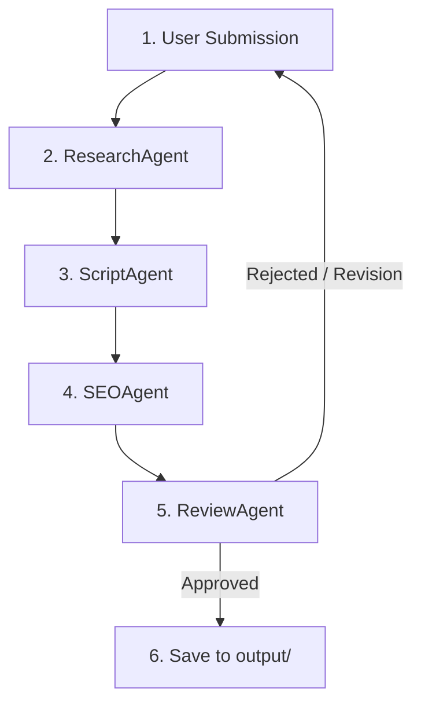

# ContentOS — AI Content Operations Platform

ContentOS is a state-of-the-art, multi-agent content production system built using the **Google Agent Development Kit (ADK) 2.0** and powered by the **Gemini 2.5 API**. It automates content research, scriptwriting, SEO metadata generation, and quality assurance reviews within a single unified pipeline.

## 🚀 Key Features

*   **ADK 2.0 Graph Workflow:** A fully coordinated sequential workflow managing structured state transitions across multiple specialized agents.
*   **Web-Grounded Research:** The Research Agent uses Google search grounding or Brave Search MCP tool integrations to pull actual sources and statistics with full citation mapping.
*   **Voice Alignment:** The Script Agent enforces strict channel voice guidelines (lowercase styling, direct hooks, structured main points, and clean CTAs).
*   **Premium Flask Dashboard:** Real-time polling updates, detailed modal outputs, and a custom Human-in-the-Loop (HITL) interactive review gate.
*   **Session Persistence:** Automatic session state recovery using browser `localStorage` to prevent state loss on page reloads.
*   **Cloud Ready:** Fully optimized for containerized environments like Google Cloud Run with single-worker multi-threaded Gunicorn configuration and pinned Session Affinity.

---

## 🛠️ Architecture & Workflow

The orchestrator manages data flow across 5 specialized node agents:



1.  **User Submission:** Topic ideas are input via the CLI or premium web dashboard.
2.  **ResearchAgent:** Gathers high-quality sources and compiles a verified research brief.
3.  **ScriptAgent:** Translates the brief into a voice-compliant script.
4.  **SEOAgent:** Generates optimized titles, tags, video description, and thumbnail design briefs.
5.  **ReviewAgent:** Assembles files and holds execution at a non-blocking Human-in-the-Loop review gate for final approval, revision loops, or rejection.

---

## 📂 Project Structure

*   [`agents/`](file:///c:/Users/acer/OneDrive%20-%20ELCOT/Desktop/contentos/agents/): Code implementations for all agents (`orchestrator.py`, `research_agent.py`, `script_agent.py`, `seo_agent.py`, `review_agent.py`).
*   [`frontend/`](file:///c:/Users/acer/OneDrive%20-%20ELCOT/Desktop/contentos/frontend/): Flask application and HTML/CSS/JS dashboard (`app.py`).
*   [`config/`](file:///c:/Users/acer/OneDrive%20-%20ELCOT/Desktop/contentos/config/): MCP server configuration wrapper (`mcp_config.py`).
*   [`evals/`](file:///c:/Users/acer/OneDrive%20-%20ELCOT/Desktop/contentos/evals/): Evaluation runner, datasets, and configurations (`eval_runner.py`, `evalset.json`, `eval_config.yaml`).
*   [`skills/`](file:///c:/Users/acer/OneDrive%20-%20ELCOT/Desktop/contentos/skills/): System prompt behaviors and instructions.

---

## 💻 Getting Started

### Prerequisites
*   Python 3.11+
*   Google Gemini API Key

### Setup & Installation
1. Install project dependencies:
   ```bash
   pip install -r requirements.txt
   ```

2. Create a `.env` file in the project root:
   ```ini
   GOOGLE_API_KEY=your_gemini_api_key_here
   MCP_SEARCH_API_KEY=your_optional_brave_api_key
   FLASK_SECRET_KEY=your_flask_session_secret
   GOOGLE_CLOUD_PROJECT=your_gcp_project_id
   GOOGLE_CLOUD_REGION=us-central1
   ```

3. Launch the development server:
   ```bash
   python frontend/app.py
   ```
   Open `http://localhost:5000` in your web browser.

---

## ☁️ Google Cloud Run Deployment

To deploy the application to Google Cloud Run, use the following `gcloud` command to build and deploy the container securely with Session Affinity enabled:

```bash
gcloud run deploy contentos \
  --source . \
  --port 8080 \
  --region us-central1 \
  --allow-unauthenticated \
  --no-cpu-throttling \
  --session-affinity \
  --set-env-vars="CLOUD_RUN=true,MOCK_PIPELINE=true"
```
